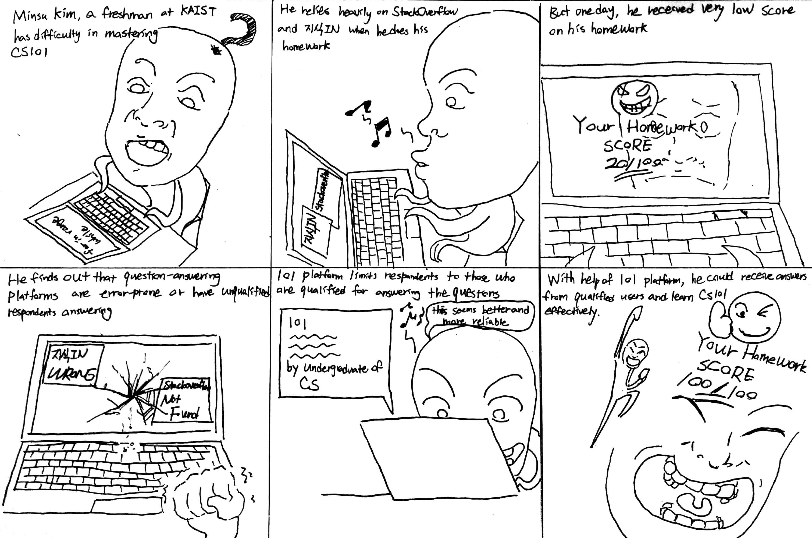
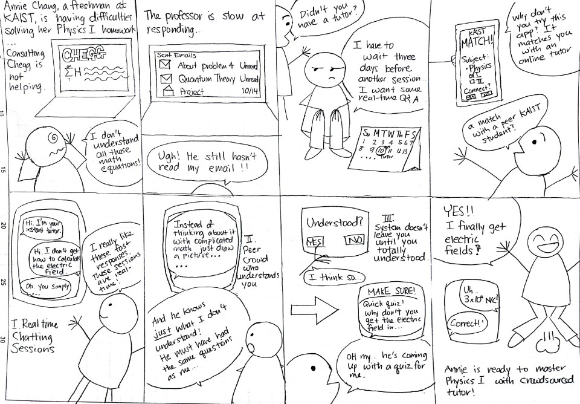
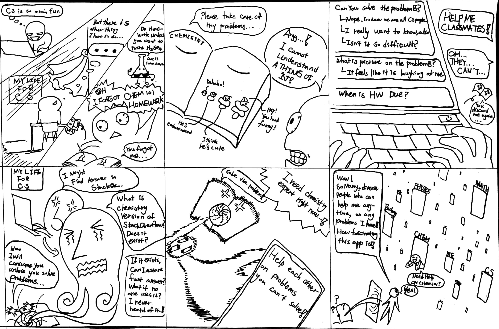

# Milestone 2: Tasks and Storyboards

**Kyung Je Jo 20130799**

**Chae-Ryn Chang 20150893**

**John Joon Young Chung Audit**

### Task 1 - Evaluate respondent’s quality through using gold data

Minsu Kim, a freshman at KAIST, often relies on Naver’s kin and Stackoverflow when he does his homework. However, he finds out that while such question-answering sites offer great efficiency and easy access to tons of information he wants, they are error-prone. After complaining to respondents who gave him wrong answers, he realized that many of them are extremely unqualified to answer his questions. 

#### Requirements or Design Goals

* Select qualified respondents for each questions or categories algorithmic system can automatically select 
* Provide appropriate level of gold data based on the level of the course which the asked question is from
* students will have higher accessibility to high-quality answers

### Task 2 - Make asking-answering communicative

Annie Chang, a freshman at KAIST, is having trouble with completing homework problems for Physics I. She tries to find answers on Chegg, but does not understand the answer explanations and would like to take more interactive tutor sessions. Instead of spending an allotted amount of time one-on-one, however, she would prefer an online feedback interface that answers her specific questions. 

#### Requirements or Design Goals

* The chatting session allows nearly real-time communication between the asker and the answerer → Instant Chatting
* The chatting session should not be ended prematurely without assuring that the user understood the answer. ex) The user could not understand the answer, but the one who answered escaped without a word after the session
* The chatting session allows users to ask follow-up questions, so as to reduce wait-time between new questions. ex) the user is usually allowed to ask only one question per session, while he may have other closely related questions that could be answered by the same answerer

### Task 3

John Doe, who is CS undergraduate at KAIST, is taking chemistry 101 lecture, but cannot solve the homework problem 8. Because the homework deadline is tomorrow, he needs to know how to solve the problem quickly. First he looks up in class Piazza, but everyone is just saying that they cannot solve the problem 8. It is definitely because the pool of the class is so small, or because they are all incapable of solving it. John turns to the online website, but could not know which site is chemistry version of Stackoverflow, where to find the answer to his problem. 

#### Requirements or Design Goals

* Assure that people from diverse background are in the system to support answering of various kinds of problems. ex) Where to find chemistry problem-solution, which is like Stackoverflow
* Assure fast question-answering with sufficient amount of people need to be in the system. ex) Come up with question right before exam, and need to get the answer quickly
* Assure the user group can assure decent solution quality if their responses are aggregated. ex) See the answer in the piazza, but disappointed because nobody could clearly answer the question. 

