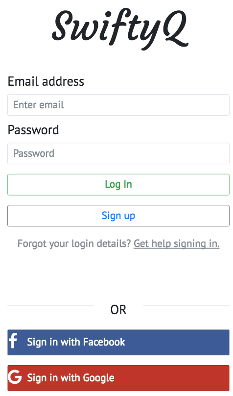
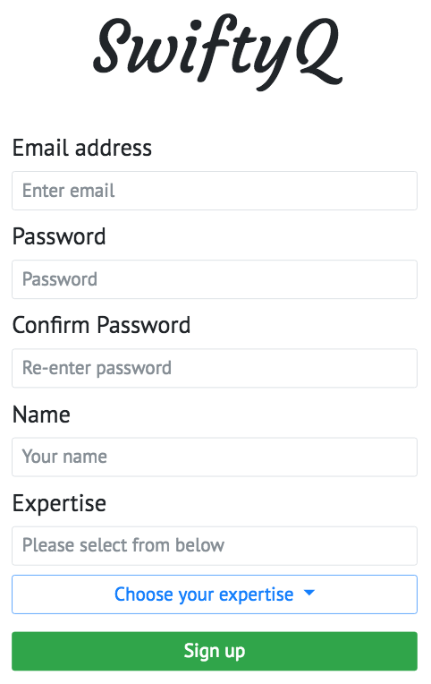
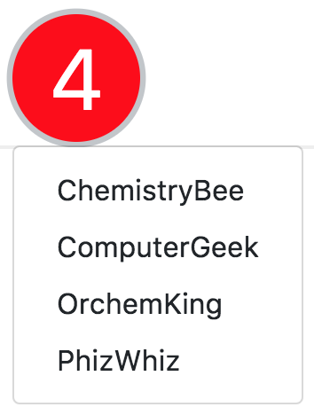
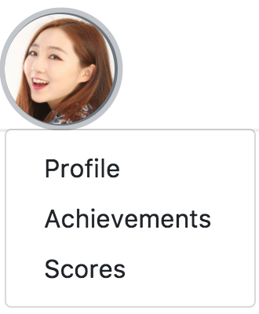
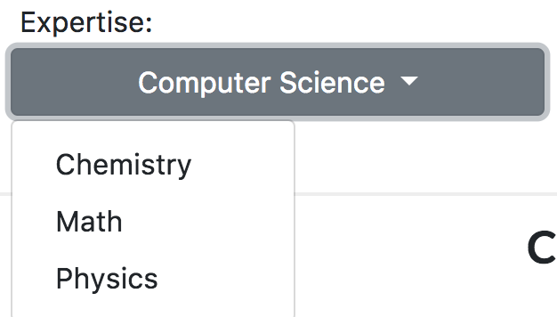
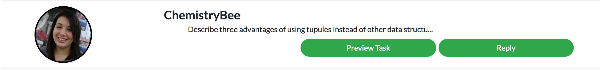
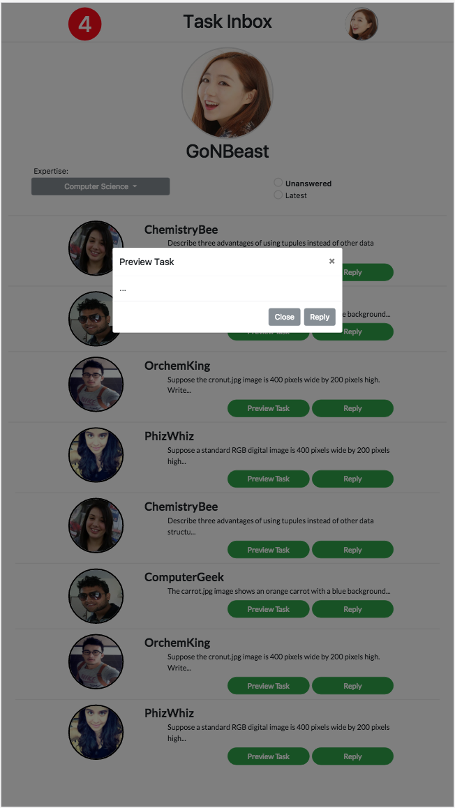
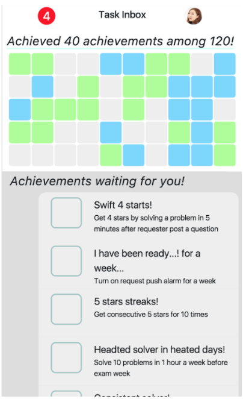

# Milestone 1: Problem Identification and Ideas

**Kyung Je Jo 20130799**

**Chae-Ryn Chang 20150893**

**John Joon Young Chung Audit**

### Purpose
The main purpose of our application is real-time chatting tutor sessions. Our design centers around efficient chatting interface and achievement systems for motivation. 

* Be aware that the application is implemented for mobile (best suitable for Galaxy S5)

### Instructions

#### index.html (entry point)

Currently available functions: input fields (email, password), Login and Sign up. 
This is a typical login page which a user will encounter on any typical mobile apps. They have three options: to sign up independently with our app, to sign up with Facebook or Google. For now, try signing up first. After that, try logging in (currently, we do not verify any of email and password)

#### signup.html (signing up)

Currently available functions: all fields work, but only workProgramming works for expertise 
This is the page that allows a user to sign up. Most of them are identical to typical signups. Expertise is the key part of signup. The user can choose expertise(s) using the dropbar. As the user fills in all fields, the user can click sign up button. Then the app will verify the user’s expertise, in the purpose of quality control, using three gold data questions through prompts. Only those users who pass all three tests can successfully sign up. 

#### inbox.html (main page)

This is the main page (the profile page) of our application. It shows the user the “task inbox,” in which various other users can ask questions on the subject of the user’s expertise. The key features of the main page are:

1. 

push alarm that notifies the user of pending tasks

2.

button that takes the user to achievements and ranking pages

3.

a dropdown button where the user can choose his expertise

4.

message previews in the inbox itself, and two buttons:

4-1. Preview task

will show the entire question, which the user can choose to answer

4-2. Reply

will take the user to the message page, where instant chatting begins

Although we have implemented frontend UI’s for the most part, we have yet to implement the backend features. Our prototype will direct the users to right pages, but the pages will not actually work properly. For example, hitting the reply button will take the user to the chat page, but the user cannot actually chat on the page. Still, the prototype captures the general design of the application. 

#### achievement.html

* In achievement, you can view achievement display that shows what you have achieved and what you can achieve. In the grid display, what you achieved is in green color, and what you can achieve is in blue color. Also, what you not yet can achieve, but can achieve as you achieve other things is shown in grey. 
* Also, you can see what achievements you can achieve specifically. They are shown with icons, titles, and specifications of achievements.

* When you satisfied conditions of an achievement, then an achievement message does pop up, notifying the user.

