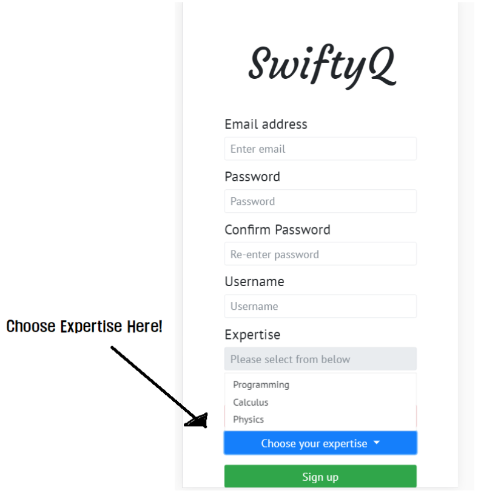
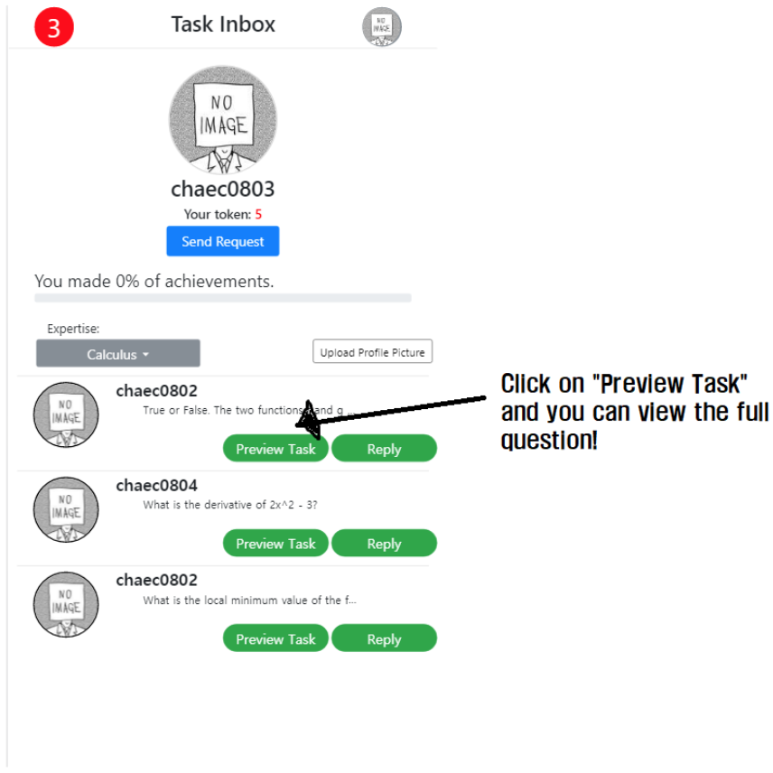
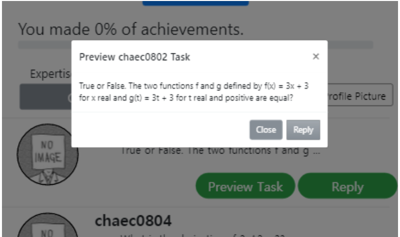
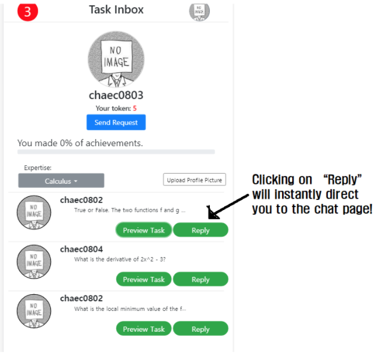
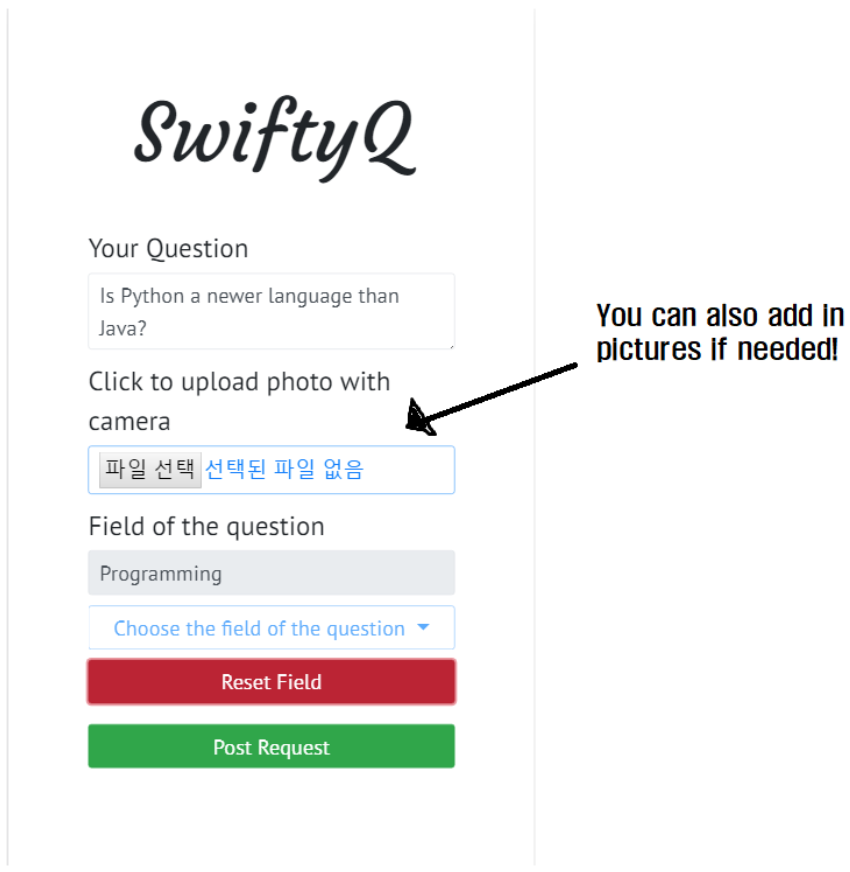
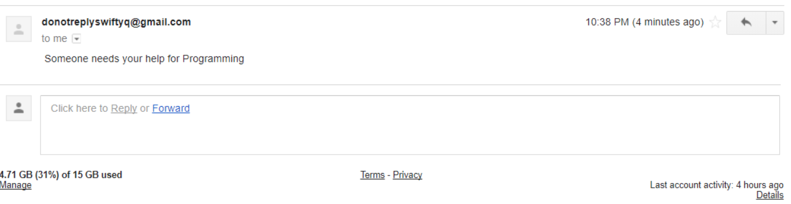
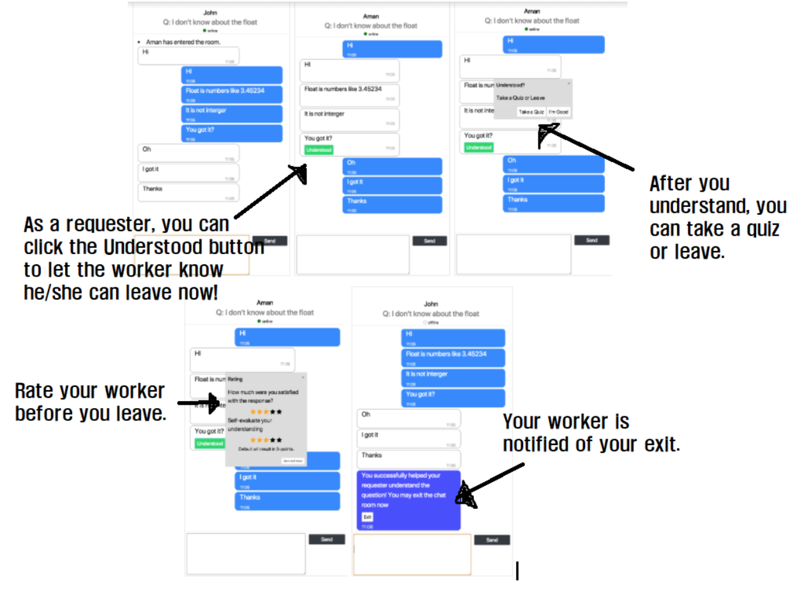
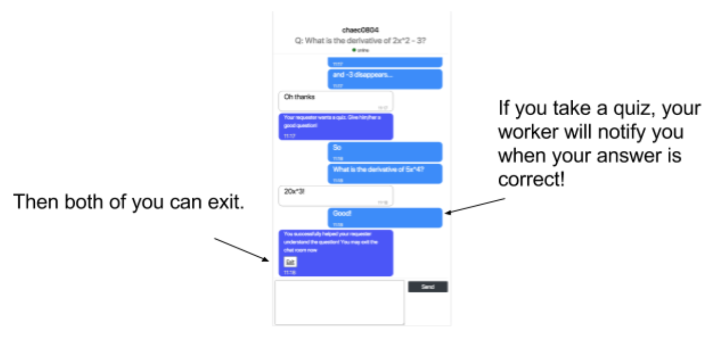
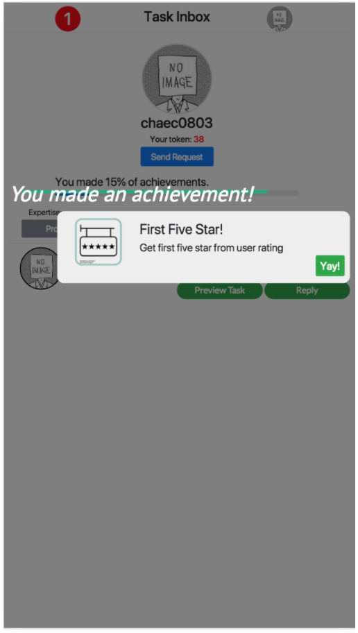
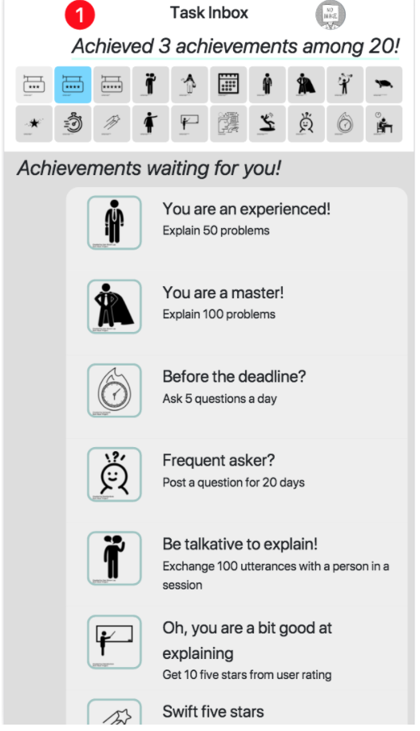

# Milestone 6: High-Fi Prototype
**Kyung Je Jo 20130799**

**Chae-Ryn Chang 20150893**

**John Joon Young Chung Audit**
## [link to our prototype](http://115.68.222.144:3000/)
## Project Summary
Question-answer websites are often too slow to answer and do not allow direct interaction between the requester and worker. SwityQ is a real-time chatting Q&A interface in which the requesters can actively ask questions directly to the workers who will help them understand the problem. The application allows for fast and accurate answers by sending emails once a request is paged and encouraging workers through an entertaining achievement system.

### Instruction:
1. Sign-up: Register as one of our valuable crowd-workers! You can enter in your expertise on which you can help your fellow Swifties by answering their questions!



2. Profile-Inbox: Here, you can see a brief summary of your status—your profile picture, expertise, and achievement tokens—and view a list of questions you can answer.

3. Request: You can make a request—ask a question—directly on this page.

 Every request you make will land in the emails of all Swifties with corresponding expertise. Just send a question and wait for a worker to answer you!

4. Chat page: chat with your fellow Swifty (either a requester or a worker) to answer questions or ask questions! If you are a requester, you can click the “understood” button following the explanation to let your answerer know he/she has finished their job. If you are a worker, help your requester understand and earn tokens for a job well done!

5. Achievement : Achieve various awards that will motivate you to be a swift and reliable helper! If you get high ratings from other users by solving problems, or if you are really quick and responsive to other’s call for help, then you can accomplish awards that SwiftyQ prepared for you! Feel content with what you achieved by viewing achievement panel, and try harder to become a better problem solver!

## Prototype
### End-to-End Scenario
Chulsoo, who is struggling with Calculus problems decided to use SwiftyQ to get some help from students who are good at math. Chulsoo first signs up for SwiftyQ, designates himself as a programming expert, and takes a short quiz to prove himself as a programming expert. After signing up, he rightly request a problem with tokens initially given to him. Chulsoo gets respond shortly after posting a question with notification via e-mail, and is connected with Minji, who is a math expert. In chat interface, Minji teaches Chulsoo about how to solve the problem he asked. After Chulsoo got how to solve the problem, he hits the ‘understood’ button to notify that he is good with the explanation. Chulsoo leaves the chat session after he leaves a rating.
Chulsoo asks more question when he come up with a problem that he cannot solve. When he runs out of token, he decides to teach some problems for other. He finds a couple of problems that he can solve in the inbox.  He hits ‘Reply’ button for the questions he can solve, and waits for the requester. When the requester comes, he quickly explains the problem. After the requester hits the ‘Understood’ button, she also asks for additional quiz that can test herself. Chulsoo gives her an additional problem that can test her understanding. With satisfaction, she gives Chulsoo five stars for the rating, and Chulsoo realizes that he achieved 3 achievements at one time. He was not only good at solving the problem, but also quick in solving the problem. Motivated, Chulsoo decides to solve more problem to get lesson himself by helping others and to achieve more awards. Now he frequently checks his e-mail inbox to know whether there is anyone who needs his help.

## Implementation Notes
### README for GitHub
We have divided our static and executable files into three major folders for readability and maintenance:
* Templates: this folder contains all the html files for the website; every page has html code of its own—index.html, signup.html, request.html, inbox.html, chat.html, achievement.html
* Static: this folder contains all the backend javascript files, css code, as well as all the images and database for our application
* - Js folder: contains javascript code for event-handling and user-input interaction for our HTML documents
* -  Css folder: contains css code for displaying different HTML elements on the web browser
* Server.py: contains code for the server process that allows web browser interactive access to the HTML files
* Docs: this folder contains the milestone reports that have been submitted so far
### Libraries and frameworks:
* Bootstrap: framework for displaying HTML elements
*  jQuery: framework for document traversal and event handling
*  Python-flask: micro web framework for developing the web server
* sqlite3: embedded SQL database for manipulating user data
* socket.io: framework for chatting—allows bidirectional communication

## Individual Reflections
### Chae-Ryn Chang:
I focused on developing the inbox page. In a general sense, I took in user input as variables for important profile-page features such as unanswered requests and the profile picture, and displayed this information on the web browser for the inbox page. Being a complete stranger to all three languages—HTML, javascript, and css—used for implementation, I had a particularly difficult time in contributing to coding. The bootstrap templates for page display structure—such as containers—and other graphic elements—such as dropdowns and buttons—helped me out a lot, but it still took me an enormous amount of time to get used to coding in HTML. Still, I was very impressed by my own progress whenever I successfully made a modal pop out at the press of a button, or whenever I directed the user to the correct url by manipulating the HTML text. As a front-end developer, I didn’t spend much time on the server program, but I still implemented critical aspects such as manipulating contents on the request table database to extract relevant questions for each worker.
I was also in charge of creation and design-flow of the “Understood” button of the application, but faced disappointing results. At first, I wanted the “Understood” feature to be more interactive—the original design was to allow the worker to input the “quiz” on a modal on his/her end and send the quiz input directly to the requester’s end after he/she had pressed the Understood button. However, given my lack of expertise, I was unable to direct this interaction. Instead, the understood button simply lets the user know that the requester has now pressed the button—which is not much, considering that this button was supposed to be a critical aspect of our webpage. On the other hand, the button does still attempt to offer the requester an upper-hand in timing. If a requester does understand immediately and wants to leave, he/she can press the button and let the worker know, without spending more time on the tutor session.
Another difficulty was getting the question-and-answer process to be real time. Since this chatting platform achieves interactivity by sending emails and utilizing socket.io, we had a difficult time in directly manipulating push alarms or events directly on the inbox webpage. Therefore, we had to send emails instead of actual app-based notifications whenever a request was paged. Also, we originally had designed the application so that the workers would be alarmed of a “pending” request when the requester begins to write in the question on the request form. However, such event-based implementation was difficult, so we had to be content with the email notification as a whole. Therefore, the whole Q & A process might not be as “real-time” as we had hoped in the original scheme.
Overall, the development of SwityQ was an interesting experience and I learned a lot about the server-client interaction of the network as well. One important skill that I want to mention is event-handling on javascript. By using such constructs as “$( "button-name " ).on( ‘click’, function( ){…” I could direct the users to different pages and features by taking in button-clicks as input. This was particularly interesting for me since I have little to no experience with application-level signaling, and it was very exciting to be able to extract I/O events as signals to execute my own code.

### Kyung Je Jo:
#### Contribution
Mainly on designing quality control. Other contributions in implementation - Initialization of server using flask, initialization & structuring database, entry page (index) and signup page (signup), modification of header layout, implementation of real-time chatting, real-time email notification.
For a question-answer platform to work properly, we not only require qualified workers in the worker pool but also their consistent performance in replying questions. Therefore, quality control is an essential part, but designing quality controls without compensating user experience was challenging. My main focus was on quality control over all crowds within the interface. The quality of crowds is managed in three-phases. <1st quality control - signup> If we allow unqualified workers in the pool, the overall quality of responses may become poor. As a solution, our potential crowds only are approved of their expertise if they pass our gold standard questions in signup. This is to ensure crowds entering the system to have at least one expertise to keep organic environment of the system. <2nd quality control - token management> Too much freedom in number of possible requests and responses may lead to unexpected consequences such as spamming or trolling. As a solution, initially, all crowds will start with five tokens. The crowd will use a single token to upload a question; the crowd will receive one or two tokens as they reply depending on their rating by the requester. Token management was to prevent any crowd bombarding with questions or maliciously spamming the system. In addition, we expect token system to motivate users to response with efforts and consideration. <3rd quality control - rating management> To allow system to work properly in long-term, consistent quality management is necessary. SwiftyQ does this by rating management. If crowd performs poorly in replying questions, then requester of the question will give the respondent crowd low rating. Consistent poor performance will lead to a warning eventually to a banning.
#### Difficulty
Any collaborative programming requires numerous challenges. Even if we divided our tasks on page-basis, we encountered huge numbers of conflict pushing the updates to git repository. However, since we worked together the most of the times, we could easily handle conflicts through communication. Another challenge was keeping our coding style independent as well as any javascript or css files. To avoid overlapping, we maintained .js and .css files independently, minimizing the risk. Though it is not the most effective collaborative programming, we valued the risk-minimizing and efficiency in our prototype. Lastly, unlike web-based interface, it was challenging to maintaining the consistency in the interface. Template-based approach could not be optimized in mobile environment. For example, header differed for almost every page. Consequently, this challenge led us to even more challenges leading to major and minor modifications to independent pages.
#### Lessons
In this implementation, real-time chatting between requester and respondent was one of the key feature. I had little experience in using socket.io for real-time communication. Through prototyping, I implemented our chatting using socket.io. I learned that it is challenging to maintain user information when there are a lot of exchanges between users. For example, we had to set flags to identify which user is online or offline. Moreover, we implemented numerous modals in chatting, each modal displaying in only either user.

### John Chung:
#### Contribution
Design and implementation of achievement systems, some visual enhancement, request page and achievement page, small modifications all around components.
My main contribution is design and implementation of achievement systems. It serves three purpose : 1) Promoting better quality in problem solving by motivating users with awards 2) Promoting agile answering with achievements related to responsiveness and 3) Continuous engagement of users with gradual conditions of achievements. To achieve 1), I implemented awards that can be achieved when users received high ratings. For 2), there are some achievements related to time. For instance, when an user solves a problem in 5 minute with a rating of 4 or 5, she can receive an award. For 3), the condition of achievement gradually changes. For instance, the threshold for achievements gradually increases, like from a requirement of 10 five stars to that of 20 five stars.
#### Difficulty
Designing various and engaging achievement was major difficulty. Because we only had ratings as a measure of an user’s performance, coming up with various achievements was difficult. Also, coming up with abstracted database was another obstacle. Because we could not store every problem solving result due to efficiency of the system, we should have selectively saved features which can be used in calculating all the achievement results. Finding most efficient metric was a bit hard.
